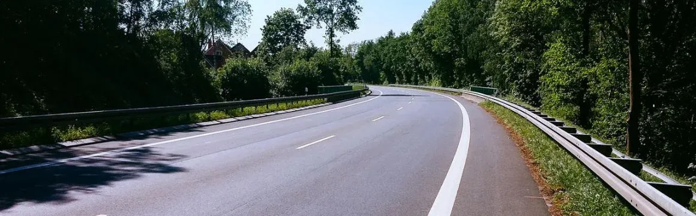

# Car in Bulgaria / Wiki / Guide

## Table of Contents

* [Где покупать, плюсы и минусы](#где-покупать-плюсы-и-минусы)
* [Технический осмотр](#технический-осмотр)
* [Водительские права](#водительские-права)
* [Обмен водительских прав на болгарские](#обмен-водительских-прав-на-болгарские)
* [Штрафы](#штрафы)
* [Винетка для дорог Болгарии](#винетка-для-дорог-болгарии)
* [Перемещение по Европе на машине (для резидентов Болгарии)](#перемещение-по-европе-на-машине-для-резидентов-болгарии)
   * [В Румынию и Шенгенскую зону (через Венгрию)](#в-румынию-и-шенгенскую-зону-через-венгрию)
   * [В Сербию (TBD)](#в-сербию-tbd)
* [Налог на автомобиль](#налог-на-автомобиль)
* [Какие документы на автомобиль нужно возить с собой в Болгарии](#какие-документы-на-автомобиль-нужно-возить-с-собой-в-болгарии)
* [Использование зимних шин](#использование-зимних-шин)
* [Обязательная страховка гражданской ответственности](#обязательная-страховка-гражданской-ответственности)
* [Заправка](#заправка)
* [Регистрация автомобиля](#регистрация-автомобиля)

*Последнее обновление: 18.02.2025*

# Где покупать, плюсы и минусы

Сводная табличка с плюсами и минусами:

| Кто продает | Номера BG | Много вариантов | Безопасная покупка | Легкая покупка | Низкая цена | Легко посмотреть | Хорошее состояние | Помощь с регистрацией |
| ----------- | --------- | --------------- | ------------------ | -------------- | ----------- | ---------------- | ----------------- | --------------------- |
| Авторынки   | X         | V               | X                  | X              | V           | V                | X                 | X                     |
| Trade in    | V         | X               | V                  | V              | X           | V                | V                 | X                     |
| Дилеры      | V         | V               | V                  | V              | X           | V                | V                 | V                     |
| Частники    | V         | V               | X                  | X              | V           | X                | X                 | X                     |

Выводы простые:

* Если позволяет бюджет и хочется беспроблемную машину – дилеры хороший вариант. Они же могут зарегистрировать машину. Забираете сразу на номерах.
* Если бюджета нет, то лучше искать у частников, но сразу договаривайтесь загонять машину в сервисный центр и заранее находите хороших мастеров. Принимайте решение о покупке только после того как машину полностью проверят.
* Авторынки – как правило хлам и “кот в мешке”.

Где искать машины:
https://www.mobile.bg/

# Технический осмотр

* Для новых машин — первый раз технический осмотр нужно будет пройти через 3 года, второй — через 5 лет.
* Для машин старше 5 лет - технический осмотр надо проходить раз в год.
* Для прохождения технического осмотра нужен набор документов и вещей в машине, подробнее со списком можно ознакомиться тут:
  https://radial.bg/content/news/gtp/
* Среди документов потребуется страховка и оплаченный налог за автомобиль в муниципалитете.

# Водительские права

* С обычными российскими правами можно ездить до 1 года с момента получения ВНЖ.
* Международные права (большая книжка) не требуются.
* При наличии ПМЖ и ДВЖ права надо менять на болгарские.
* Поменять (вроде бы) не сложно. Раньше требовался диплом о среднем образовании, сейчас это требование отменили, подробнее в этом всем написано в следующем разделе.
* Новые права выдают через 30 дней.
* Срок действия новых прав — 10 лет.
* Надо учитывать, что на болгарских правах бальная штрафная система из 39 точек.

Подробнее здесь: https://bglegal.org/chdl

Видео на тему: https://youtu.be/\_URBncUAxo0?si=PY\_TjXG7Ap6BP9Xt

# Обмен водительских прав на болгарские

* Если вы получили [ВНЖ в Болгарии](https://bglegal.org/vnj), то через 185 дней можете считаться резидентом этой страны и получаете возможность поменять своё водительское удостоверение на местное (имеющие ВНЖ по [Синей карте ЕС](https://bglegal.org/bluecard) и [ЕРПР](https://bglegal.org/wspermit) могут попробовать и раньше, т.к. такое разрешение на пребывание может быть сроком и на три и на 5 лет, а значит чиновник может поверить, что вы в Болгарии всерьёз и надолго)
* Если вы получили ПМЖ (или [ДВЖ](https://bglegal.org/lseu)), то менять права уже обязательно (в течение года), в противном случае ваше удостоверение будет признано не надлежащим и, как следствие, высокий штраф и отстранение от управления ТС (подробно [читайте здесь](https://bglegal.org/chdl)).
* Обмену подлежат водительские удостоверения, выданные в странах-участницах Венской конвенции о дорожном движении, и соответствующих требованиям этой Конвенции в действующей редакции.
* Процедура обмена водительского удостоверения в Болгарии достаточна проста. Для этого вам необходимо пройти медкомиссию — если вы не собираетесь работать водителем профессионально, то это всего три врача — окулист, хирург и невропатолог (а данные, что вы не стоите на учете у нарколога и психиатра уже есть в базе МВР).
* Пройти врачей можно, например, вот здесь https://dkc4varna.com/prices.php
* Далее, с простыми копиями личной карты, старого водительского удостоверения (его достаточно просто скопировать, переводить и легализовывать не надо), а также оригиналом медицинской справки являетесь в КАТ, заполняете заявление, сдаёте документы, оплачиваете пошлину.
* Через месяц приходите, сдаёте своё старое водительское удостоверение, получаете новое болгарское (действует 10 лет, потом надо будет менять). ВУ ничем не отличается от обычного болгарского, кроме раздела ограничения, в котором стоит код 70, который означает, что удостоверение выдано взамен, например, российского. И это значит, что в случае смены резидентства, вы сможете их поменять без сдачи экзаменов только в странах, которые напрямую могут менять удостоверения первой страны выдачи, например, в Италии и Польше без проблем, а в Испании и Германии придётся сдавать экзамен.
* Получить медицинскую справку и подать документы в КАТ вы можете только **лично**, по доверенности это сделать невозможно.

Подробнее: https://bglegal.org/changedl

# Штрафы

* Проверять штрафы можно здесь https://e-uslugi.mvr.bg/services/obligations.
* При простом нарушении выписывают так называемый ФИШ – его можно оплатить в банке или (вроде бы) онлайн через https://www.epay.bg/.
* При более серьезном нарушении выписывают Наказательный Акт. В этом случае решение о размере штрафа принимает руководитель в КАТ, а не сотрудник остановивший вас. Есть вилка размера штрафа за определенное нарушение.
* В момент остановки на дороге выписывают Наказательный Акт + забирают контрольный (синий талон) который является неотъемлемой частью прав (тот самый с 39 точками). Сам штраф нужно ходить в КАТ и проверять когда придет (примерно месяц). Затем с квитанцией об оплате придти в КАТ и получить свой контрольный талон обратно (и конечно не досчитаться точек). А пока ездить с правами и тем самым Наказательным Актом.
* При более серьезном нарушении, например за алкогольное опьянение – права с синим талоном отбирают на месте.

Примерный размер штрафов:

|                                        |                                                              |
| -------------------------------------- | ------------------------------------------------------------ |
| Не пристегнутый ремень                 | 50 лева (25 евро + 10 точек)                                 |
| Разговоры по мобильному                | 50 лев (25 евро)                                             |
| Превышение от 11 до 20 км/ч            | 50 лева (25 евро)                                            |
| Превышение от 21 до 30 км/ч            | 100 лева (50 евро) + 2 точки                                 |
| Превышение от 31 до 40 км/ч            | 400 лева (200 евро) + 6 точек                                |
| Превышение больше 40 км/ч              | 600 лева и 12 точки                                          |
| Превышение больше 50 км                | 700 лева и за каждые следующие 5 км + 50 лева                |
| Алкогольное опьянение                  | от 0.5 до 0.8 промилле – 500 лева (250 евро) + 10 точек + 6 месяцев без прав |
| Не читаемый номер                      | 50 лева (25 евро)                                            |
| Парковка на инвалидом месте без талона | 200 лева (100 евро)                                          |
| Парковка на тратуаре                   | от 50 до 200 лева (25–100 евро)                              |
| Езда без винетки                       | 300 лева (150 евро)                                          |
| Опасные маневры                        | от 50 до 200 лева (25–100 евро)                              |

# Винетка для дорог Болгарии

* Винетка – это оплата налога на использование дорог. По сути, она дает вам разрешение ездить по дорогам общего пользования. Кроме этого есть отдельные платные дороги. Винетка нужна не везде, но там где нужна – обычно стоит соответствующий знак.
* Этот знак означает, что двигаться по этой дороге без винетки нельзя, за ее отсутствие будет выписан штраф – 150 евро.
* Следят за этим как камеры, в автоматическом режиме, так и сотрудники АПИ (Агенция Пътна Инфраструктура). Они дежурят на дорогах как и КАТ, могут вас остановить и проверить наличие винетки. Точнее, они сканируют номера и уже останавливают тех, кто едет без винетки.
* Раньше винетка она была физической и крепилась на стекло.
* С 2019 года действует и старая форма и новая, электронная.
* Электронную винетку можно купить, например, здесь https://web.bgtoll.bg/.
* Стоимость на год 89 лева (45 евро).

Статьи на тему:

* https://hotrentcar.com/blog/vinetka-v-bolgarii-chto-eto-kak-rabotaet
* https://buladvisor.com/rashody-na-avtomobil/

# Перемещение по Европе на машине (для резидентов Болгарии)

## В Румынию и Шенгенскую зону (через Венгрию)

* ~~Румыния, как и Болгария, члены ЕС и с апреля 2024 года частично вошли в Шенгенскую зону. Проверки документов отменены при авиаперелетах, но пограничные пункты на дорогах на данный момент остаются и действуют.~~
* ~~Границу надо будет переходить два раза — один раз из Болгарии в Румынию, и затем из Румынии в Венгрию.~~
* ~~Все что потребуется для пересечения границы с Румынией / Шенгенской зоной на машине для резидента Болгарии — это паспорт, ВНЖ (или ДВЖ, ПМЖ) и малый регистрационный талон на автомобиль.~~
* C 1 января 2025 года Болгария и Румыния полностью вошли в Шенгенскую зону. Границы между ними, а также между Румынией и Венгрией, больше нет.

Также надо иметь с собой, но это не спрашивают:

* Общеевропейскую страховку (зеленая карта);
* Если машина зарегистрирована на ЮЛ, то лучше иметь нотариальную доверенностью от компании на вас для совершения действий в случае ДТП;
* Винетки для каждой страны, через которую вы будете проезжать;
* Наклейки про уровень выхлопа, если планируете заезжать в города в некоторых странах (например, в Германии).

## В Сербию (TBD)

*

# Налог на автомобиль

* Налог платится вперед (то есть не по итогам года, а на текущий год).
* Налог платят и физические, и юридические лица.
* Размер налога зависит от общины где зарегистрирован автомобиль, мощности, возраста авто и класса экологичности.
* Налог вносится двумя равными частями в установленные сроки:
  ― первая часть: до 31 марта;
  ― вторая часть: до 30 сентября.
* Выплачивающие всю сумму налога до 31 марта, получают скидку 5%.
* Калькулятор налога здесь http://www.calculator.bg/1/avtomobil\_danak.html.
* Оплатить налог надо в течение 2 месяцев после постановки на учет.
* Чтобы оплатить налог, проще всего приехать в налоговую службу (местни данъци) той общины, где зарегистрирован автомобиль. Например, для Варны список адресов вот здесь https://www.varna.bg/bg/218.  Идете в окошко к кассиру, даете малый талон регистрации на авто и говорите, что хотите заплатить налог за этот год. Кассир рассчитает сумму налога и вы сразу сможете оплатить ее наличными или картой.
* Если срок оплаты прошел, а вы не заплатили налог, муниципалитет пришлет письмо с требованием об уплате по адресу регистрации автомобиля.
* Оплатить задолженность можно либо в кассе налоговой службы вашей общины, либо банковским переводом по реквизитам указанным в этом же письме.

Статьи на тему:

* https://bglegal.org/f/zakon\_za\_mestnite\_dantsi\_i\_taksi\_2019.pdf
* http://bulgara.ru/ru/pagein\_30\_oplata-nalogov-v-bolgaria.htm

# Какие документы на автомобиль нужно возить с собой в Болгарии

* При себе нужно иметь либо болгарские права (они состоят из двух документов, прав и талона), либо российские (международные делать не обязательно), малый регистрационный талон на автомобиль, страховку, технический осмотр, винетку.
* Также обязательно иметь с собой светоотражающий жилет, знак аварийной остановки, огнетушитель, домкрат, ключ для смены шин, запаску, аптечку.

# Использование зимних шин

Официальная часть:

* Зимние шины обязательны к использованию с 15 ноября по 1 марта.
* Не разрешается эксплуатация автомобиля на шипованной резине.

Неофициальная часть:

* В середине декабря 2024 температура от +6 до +17 градусов. Понятно, что при такой температуре для поездок внутри города можно обойтись и летней резиной.

# Обязательная страховка гражданской ответственности

* Оплачивайте страховку сразу на год и не мучайтесь.
* За отсутствие страховки штраф от 250 до 500 лева (125–250 евро) + изъятие прав до оплаты страховки.

# Заправка

* В Болгарии сначала заправляют автомобиль, а потом идут оплачивать топливо.
* На качество болгарского дизеля жалуются, имейте ввиду.

# Регистрация автомобиля

* Автомобиль можно зарегистрировать как на физическое, так и на юридическое лицо.
* При регистации на физическое лицо (у которого ВНЖ) выдают только синие номера, срок действия которых привязан к сроку действия ВНЖ. Получать такие номера нужно будет в Софии. Продлевать, соответственно, там же.
* Если у вас ДВЖ или ПМЖ, то при регистрации на физлицо можно получить и обычные белые номера, срок действия которых не ограничен.
* При регистрации на юридеское лицо (даже если у вас ВНЖ) выдают обычные белые болгарские номера без ограничения срока их действия. Получать номера можно там же, где ставите на учет. По сути это самый распространненый вариант среди приезжих – регистрируете сначала юридическое лицо, а на него уже регистрируете автомобиль.

Что почитать про регистрацию автомобиля на юридическое лицо:

* https://bulgarianexpert.com/blog/oformleniye-avtomobilya-na-firmu/
